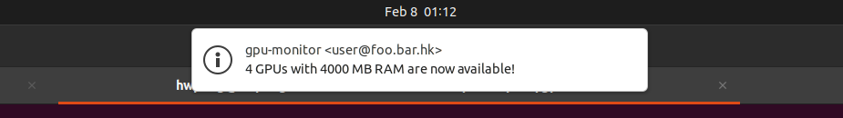

# gpu-monitor

A Python tool for polling remote GPU servers.

This tool continuously checks if GPUs are available on the specified server, using `nvidia-smi`. When the specified requirements are met, the tool stops polling and generates a notification.

## Requirements

* [paramiko](https://github.com/paramiko/paramiko)
* [polling](https://github.com/justiniso/polling)
* ffplay (Optional - required for audio notification)

```
pip install -r requirements.txt
sudo apt install ffmpeg
```


## Getting started

**Basic usage**

Notify when 4 fully idle GPUs are available:

```
python gpu-monitor.py -u <user@host> --min_gpus 4
// OR
python gpu-monitor.py -u <user> -d <host> --min_gpus 4
```

If you do not want to be prompted for the password evertime, you can specify an authorized SSH key (typically `~/.ssh/id_rsa.pub`):

```
python gpu-monitor.py -u <user@host> -k <path/to/pubkey> --min_gpus 4
```

Notify when there are 4 GPUs with *at least* 5000 MiB available RAM:

```
python gpu-monitor.py -u <user@host> --min_gpus 4 --min_ram 5000
```

Check server every 30 seconds:

```
python gpu-monitor.py -u <user@host> --step 30 --min_gpus 4
```

An explanation of each parameter is provided using `python gpu-monitor.py -h`.


**Notifications**

When the specified requirement is met, a notification will be issued. Below is an example:



Additionally, you can specify a sound file to play when GPU is available:

```
python gpu-monitor.py -u <user@host> --min_gpus 4 --alert_sound <path/to/sound/file>
```

Run the following to see if the notification is working properly:

```
python gpu-monitor.py --alert_sound <path/to/sound/file> --debug
```
